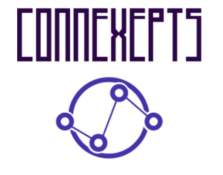

# Connexepts

This is a mind mapping software to learn and keep track of concepts and how they connect with one another for the user to become more interested and learn the subject easier.

A Flask backend was setup to accept different queries from the front-end for single and multi-word concepts. After a route is hit on the Flask backend it sends an HTTP GET request to the ContextNet open-source API. A response is given back and slightly processed until it forms a JSON structure. These JSON messages are sent to the React front-end where most of the pre-processing of the data is done using Javascript's functional lambda functions. The meta data such as association between concepts as well as literary sources are also processed. React-vis-graph is used to visualize the concepts in a network graph. The application front and back were deployed to Heroku for easy access and deployment.
## What's Next
Add full implementation for full length sentences The model currently supports multi-world phrase concepts Add storage of user progress in understanding concepts Clicking on a concept may change its color (green = understood well, red = not so well) Model has the capability for multi-lingual support but our app currently does English only. It will however translate common phrases to other languages Add picture maps and hyperlinks to other sources to strengthen the visual connections
## Setup
install virtual env

$ python3 -m venv venv

activate virtual environment

$ . venv/bin/activate

install dependencies

$ pip install -r requirements.txt

test locally (not on production)

$ flask run --debugger

install React dependencies

$ cd my-app

$ npm install

Build production bundle

$ npm run build

